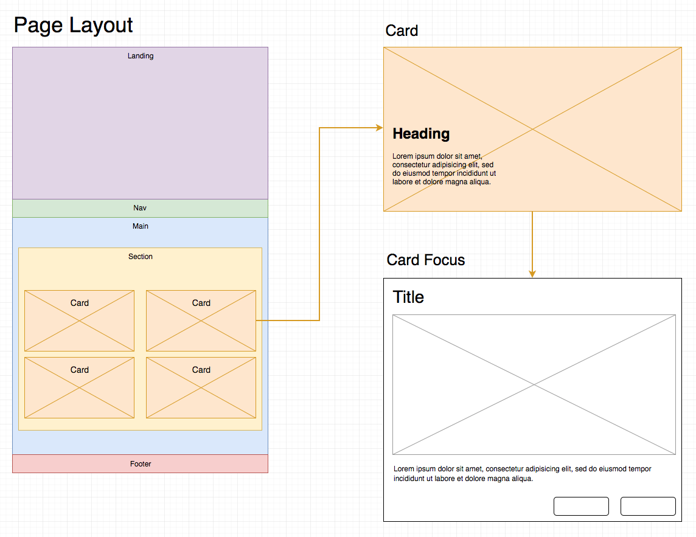

# Code Sample for Cast Iron Coding
This project is intended as a code sample for an application to Cast Iron Coding. I would like to demonstrate the creation of a static web site, from design and wireframing to the final code implementation, using plain Javascript, HTML, and CSS. Most of the projects on my GitHub use React as a front-end framework, so I am hoping that this project can show that I have a grasp on working with DOM manipulation without the use of such libraries and frameworks.

A live demo can be seen here: [https://code-sample-for-cast-iron-coding.phonofidelic.now.sh](https://code-sample-for-cast-iron-coding.phonofidelic.now.sh)

I began by creating a mockup that lays out all the main components of the site.



After that, I created a low fidelity version of the site, making sure that all of the elements rendered and behaved as expected. Once that was done, I started developing each component until they looked and felt somewhat complete and finally went back and made adjustments as needed.

I am quite  happy with how the site looks and feels, but there are a few things I would do differently if I were to continue developing this project. One of the improvements I would like to make is to build classes to handle the creation of components. I would probably not create an actual project like this using plain Javascript for the creation of DOM elements in the way it is done here, but I wanted to demonstrate Dom manipulation without the use of a front end library. 

## Development
To get started with development on this project, run the following commands:

1. ```git clone https://github.com/phonofidelic/code_sample_for_cast_iron_coding.git && cd code_sample_for_cast_iron_coding && yarn```
2. ```yarn install```
3. ```yarn start```
